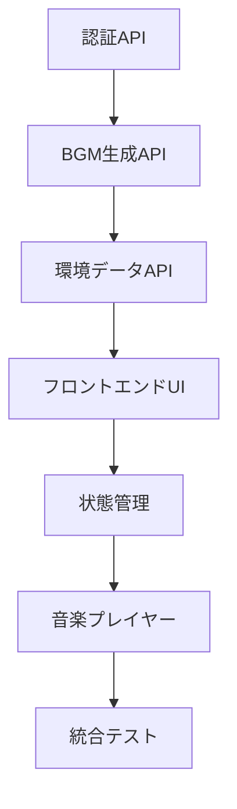

# 🚀 AI Developer クイックスタートガイド

## 📋 即座に開始するための要約

### 🎯 プロジェクト: WorkTunes AI
**概要**: 時間帯×天気連動型作業用BGM生成プラットフォーム

### ⚡ 最優先実装タスク（この順序で）

#### 1. 認証システム ⭐⭐⭐
```typescript
// apps/api/src/routes/auth.ts
POST /api/auth/register  // ユーザー登録
POST /api/auth/login     // ログイン
POST /api/auth/refresh   // トークンリフレッシュ
POST /api/auth/logout    // ログアウト

// apps/api/src/middleware/auth.ts
// JWT認証ミドルウェア実装
```

#### 2. BGM生成API ⭐⭐⭐
```typescript
// apps/api/src/services/musicGenerator.ts
// ElevenLabs Music API統合
class ElevenLabsMusicClient {
  async generateMusic(params: BGMRequest): Promise<BGMResponse>
}

// apps/api/src/routes/bgm.ts
POST /api/bgm/generate   // BGM生成
GET  /api/bgm/history    // 生成履歴
GET  /api/bgm/{id}       // 特定BGM取得
```

#### 3. 環境データAPI ⭐⭐
```typescript
// apps/api/src/services/weatherService.ts  
// OpenWeatherMap API統合
class WeatherClient {
  async getCurrentWeather(lat: number, lon: number): Promise<WeatherData>
}

// apps/api/src/routes/environment.ts
GET /api/environment/current  // 現在の環境取得
```

#### 4. フロントエンドUI ⭐⭐⭐
```typescript
// apps/web/components/EnvironmentCard.tsx
// 天気・時間帯表示UI

// apps/web/components/MusicPlayer.tsx  
// 音楽プレイヤーUI（再生・停止・スキップ）

// apps/web/store/musicStore.ts
// 音楽再生状態管理（Zustand）
```

### 🔧 必要な依存関係
```json
// 追加インストール必要
{
  "axios": "^1.6.2",           // HTTP client
  "howler": "^2.2.4",         // Audio playback
  "zustand": "^4.4.7",        // State management
  "@hookform/resolvers": "^3.3.2",  // Form validation
  "react-hook-form": "^7.48.2"      // Forms
}
```

### 🌐 外部API設定
```env
# 必須環境変数
ELEVENLABS_API_KEY="sk-..." 
OPENWEATHER_API_KEY="..."
JWT_SECRET="random-secret-key"
DATABASE_URL="postgresql://..."
```

### 📁 型定義（既存）
完全な型定義は `packages/types/index.ts` に実装済み
```typescript
// 主要型
- EnvironmentData: 環境データ（時間帯・天気）
- BGMRequest/BGMResponse: 音楽生成
- UserProfile: ユーザー設定
- すべてZodバリデーション付き
```

### 🗄️ データベース（既存）
Prisma スキーマは `apps/api/prisma/schema.prisma` に完成済み
```bash
# マイグレーション実行
npx prisma migrate dev
npx prisma generate
```

## 🎯 AI Developerでの作業開始コマンド

### Step 1: プロジェクト確認
```typescript
// 最初にAI Developerで実行すべき確認
console.log("WorkTunes AI project structure verified");
console.log("- packages/types: ", "✅ 型定義完了");  
console.log("- apps/api/prisma: ", "✅ DB設計完了");
console.log("- 基盤設定: ", "✅ Next.js + Express完了");
```

### Step 2: 認証API実装指示
```
【AI Developerへの指示】
apps/api/src/routes/auth.ts ファイルを作成し、
JWT認証システムを実装してください。

要件:
- bcryptjs でパスワードハッシュ化
- JWT + Refresh Token方式
- packages/types の型定義使用
- Prisma User モデル使用
- エラーハンドリング完備

参考: packages/types/index.ts の LoginRequest, RegisterRequest, AuthResponse 型
```

### Step 3: 音楽生成サービス実装指示  
```
【AI Developerへの指示】
apps/api/src/services/musicGenerator.ts を作成し、
ElevenLabs Music API統合を実装してください。

要件:
- 環境データ（時間帯×天気）からプロンプト生成
- API呼び出し・エラー処理
- 生成結果のキャッシュ機能
- BGMRequest/BGMResponse 型の厳密使用

ElevenLabs API仕様:
POST https://api.elevenlabs.io/v1/music/generate
```

### Step 4: UI実装指示
```
【AI Developerへの指示】
以下のReactコンポーネントを実装してください:

1. apps/web/components/EnvironmentCard.tsx
   - 現在の天気・時間帯表示
   - アニメーション付きアイコン
   - レスポンシブデザイン

2. apps/web/components/MusicPlayer.tsx  
   - Howler.js使用の音楽プレイヤー
   - 再生・一時停止・スキップボタン
   - 進捗バー表示

3. apps/web/store/musicStore.ts
   - Zustand状態管理
   - 音楽再生状態・履歴管理
```

## 🔄 開発フロー



## ⚠️ 重要な実装ポイント

### セキュリティ
- JWT有効期限: 15分（Access）+ 7日（Refresh）
- パスワード: bcrypt salt rounds 12
- CORS設定: フロントエンドURLのみ許可

### パフォーマンス  
- BGM生成: Redis キャッシュ 24時間
- 天気データ: キャッシュ 5分
- 音声ファイル: AWS S3 + CloudFront CDN

### エラーハンドリング
- 外部API失敗時のフォールバック
- ユーザーフレンドリーなエラーメッセージ
- ログ記録（Winston使用）

---

**🎵 このガイドでWorkTunes AIの開発をスムーズに開始できます！**