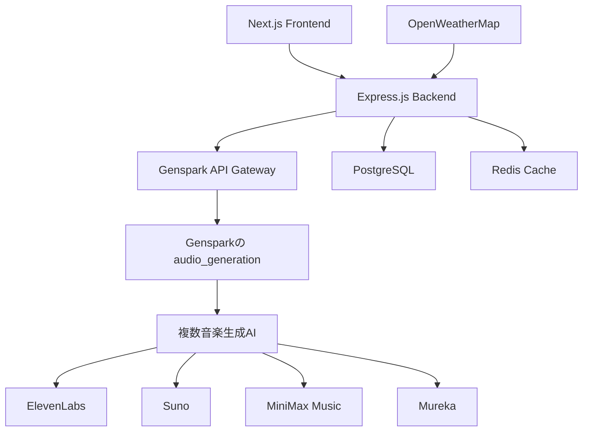

# WorkTunes AI - アーキテクチャ改訂版

## 🔄 設計変更概要

**変更前**: ElevenLabs外部API中心の独立サービス  
**変更後**: Gensparkエコシステム活用型サービス

## 🎵 新しい音楽生成アーキテクチャ

### Gensparkベース音楽生成の優位性
- ✅ **統合環境**: 複数の最先端音楽AIモデルにアクセス
- ✅ **コスト効率**: 外部API課金不要
- ✅ **品質保証**: Gensparkが選定した高品質モデル
- ✅ **メンテナンス軽減**: API管理・更新をGenspark側が担当

## 🏗 改訂アーキテクチャ図



## 🔧 実装変更点

### 1. 音楽生成サービス（大幅変更）

#### 変更前: ElevenLabs直接統合
```typescript
// 旧実装
class ElevenLabsMusicClient {
  async generateMusic(params: BGMRequest): Promise<BGMResponse> {
    const response = await fetch('https://api.elevenlabs.io/v1/music/generate', {
      // ElevenLabs API直接呼び出し
    });
  }
}
```

#### 変更後: Gensparkツール活用
```typescript
// 新実装
class GensparkMusicService implements MusicGenerationService {
  async generateBGM(request: BGMRequest): Promise<BGMResponse> {
    // Gensparkのaudio_generation toolを使用
    const result = await this.callGensparkAudioGeneration({
      model: this.selectOptimalModel(request.environment, request.workType),
      query: this.buildPrompt(request),
      duration: request.duration,
      task_summary: `BGM generation for ${request.workType} work`
    });
    
    return this.processGensparkResponse(result, request);
  }
  
  private selectOptimalModel(environment: EnvironmentData, workType: string): string {
    // 環境・作業タイプに応じて最適なGensparkモデルを選択
    if (workType === 'focus') {
      return 'mureka/instrumental-generator'; // 集中作業用
    } else if (environment.weather.condition === 'rainy') {
      return 'fal-ai/lyria2'; // 雨天時の落ち着いた音楽
    } else {
      return 'elevenlabs/v3-tts'; // デフォルト高品質
    }
  }
}
```

### 2. 環境適応ロジック強化

```typescript
// Gensparkの複数モデルを活用した環境マッピング
const environmentModelMap = {
  morning: {
    sunny: {
      model: 'mureka/song-generator',
      style: 'uplifting instrumental morning music',
      mood: 'energetic'
    },
    rainy: {
      model: 'fal-ai/lyria2',
      style: 'gentle ambient piano for rainy morning',
      mood: 'contemplative'
    }
  },
  afternoon: {
    sunny: {
      model: 'elevenlabs/sound-effects',
      style: 'focus-enhancing background music',
      mood: 'concentrated'
    }
  }
  // ... 他の時間帯・天気組み合わせ
};
```

### 3. APIエンドポイント変更

#### 変更前: 外部API管理
```typescript
// 旧設計
POST /api/bgm/generate
- ElevenLabs API Key管理
- 外部API レート制限対応
- 課金・使用量追跡
```

#### 変更後: Genspark連携
```typescript
// 新設計  
POST /api/bgm/generate
- Gensparkセッション管理
- 複数モデル選択ロジック
- 結果キャッシュ・最適化

class BGMController {
  async generate(req: Request, res: Response) {
    const request = BGMRequestSchema.parse(req.body);
    
    // Genspark音楽生成サービス呼び出し
    const result = await this.gensparkMusicService.generateBGM(request);
    
    // 結果をデータベースに保存
    await this.saveBGMRecord(result, req.user.id);
    
    res.json(result);
  }
}
```

## 🔌 Gensparkとの連携方式

### Option 1: Genspark APIエンドポイント活用
```typescript
// Gensparkが提供するAPIエンドポイント経由
const gensparkAPI = {
  endpoint: 'https://api.genspark.ai/audio/generate',
  authentication: 'Gensparkトークン',
  models: ['elevenlabs', 'suno', 'minimax', 'mureka']
};
```

### Option 2: Gensparkツール直接統合
```typescript
// WorkTunes AI内でGensparkツールを直接呼び出し
import { audio_generation } from '@genspark/tools';

const generateMusic = async (params) => {
  return await audio_generation({
    model: selectedModel,
    query: musicPrompt,
    duration: requestedDuration
  });
};
```

### Option 3: ハイブリッド実装（推奨）
```typescript
// フロントエンドは独立、音楽生成のみGenspark活用
class HybridMusicService {
  // ローカルキャッシュ + Genspark生成
  async generateBGM(request: BGMRequest) {
    // 1. キャッシュチェック
    const cached = await this.checkCache(request);
    if (cached) return cached;
    
    // 2. Genspark音楽生成
    const generated = await this.callGensparkAudio(request);
    
    // 3. 結果キャッシュ・保存
    await this.cacheResult(generated, request);
    return generated;
  }
}
```

## 📦 プロジェクト構造変更

### 新しいディレクトリ構成
```
worktunes-ai/
├── apps/
│   ├── web/                    # Next.js フロントエンド（変更なし）
│   └── api/                    # 軽量Express.js
│       ├── src/
│       │   ├── services/
│       │   │   ├── gensparkMusicService.ts    # 🆕 Genspark統合
│       │   │   ├── environmentMapper.ts       # 🔄 強化
│       │   │   └── weatherService.ts          # 変更なし
│       │   ├── routes/
│       │   │   ├── bgm.ts                     # 🔄 Genspark対応
│       │   │   └── auth.ts                    # 変更なし
│       │   └── config/
│       │       └── genspark.ts               # 🆕 Genspark設定
│       └── prisma/             # データベース（変更なし）
└── packages/
    ├── types/                  # 型定義（一部追加）
    └── genspark-client/        # 🆕 Genspark統合ライブラリ
```

## 🎯 実装優先順位（改訂版）

### Phase 1: Genspark統合基盤
1. **Genspark認証・接続設定**
2. **音楽生成サービス実装**（Gensparkベース）
3. **環境マッピングロジック**（複数モデル対応）

### Phase 2: フロントエンド連携
1. **音楽プレイヤーUI**
2. **環境表示コンポーネント**
3. **生成履歴・プレイリスト機能**

### Phase 3: 最適化・拡張
1. **キャッシュシステム**
2. **パフォーマンス最適化**
3. **ユーザー学習機能**

## 💰 コスト・メリット分析

### 変更前（ElevenLabs）
- 月額 $5-99（使用量により）
- API管理・監視コスト
- 複数プロバイダー管理複雑性

### 変更後（Genspark）
- Gensparkプラン内で利用
- API管理コスト削減
- 統一インターフェース
- 複数の最先端モデルアクセス

## 🔄 マイグレーション戦略

### 1. 既存コード活用
- 型定義（packages/types）→ そのまま使用
- データベース設計 → そのまま使用
- フロントエンド → そのまま使用

### 2. 変更対象
- 音楽生成サービス → Genspark統合に変更
- API認証 → Gensparkトークン使用
- モデル選択ロジック → 複数モデル対応

### 3. テスト戦略
- 既存ElevenLabs実装 → Gensparkラッパーで代替
- A/Bテスト → 両方式の品質比較
- 段階的移行 → リスク軽減

---

**🎵 この改訂により、WorkTunes AIはGensparkエコシステムの強みを最大限活用しながら、独立したサービスとしての価値も提供できます！**